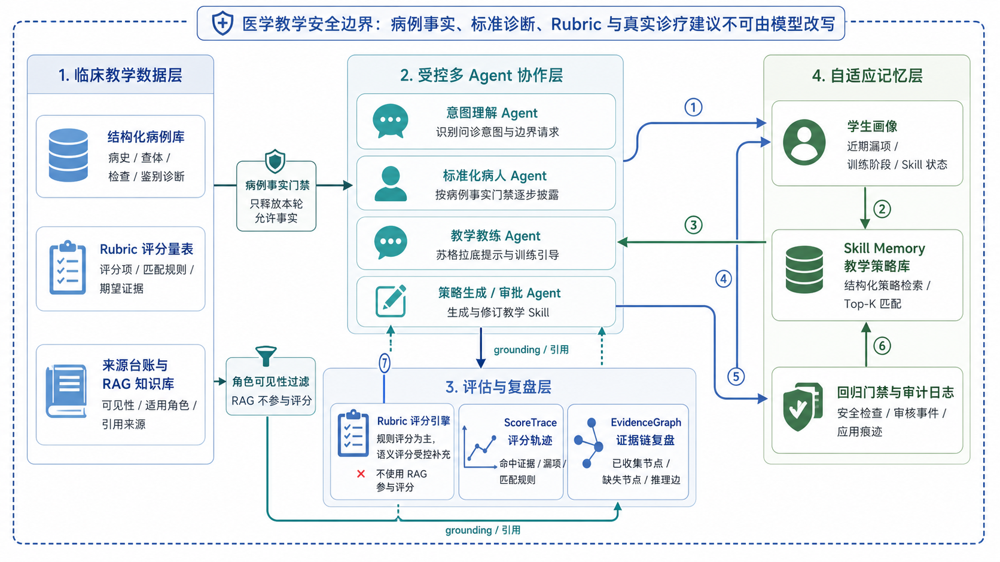

# TraceOSCE

TraceOSCE（临境 OSCE 智能体）是一个用于医学教育的 OSCE 训练平台。学生可以在结构化病例中完成问诊、查体申请、辅助检查选择、诊断提交和复盘；教师或管理员可以维护病例、评分量表、知识库和训练记录。

本项目用于教学模拟和系统研究，不用于真实诊断、治疗、用药或急救决策。

## 当前状态

- 已实现学生端、管理端和后端 API 的本地演示闭环。
- 已内置 5 个教学病例及对应评分量表。
- 已支持标准化病人对话、查体/检查结果查询、诊断提交、规则评分、报告生成、RAG 引用、学生画像和 Skill 教学策略管理。
- 当前更适合作为课程设计、比赛答辩、教学原型和研究原型；还不是生产级医疗教学平台。

## 功能概览

### 学生端

路径：`apps/web`

- 浏览病例并创建训练会话。
- 与虚拟标准化病人进行自然语言问诊。
- 申请体格检查和辅助检查。
- 记录诊断假设，提交最终诊断与推理依据。
- 查看训练报告，包括分项得分、遗漏项、教师式复盘、知识建议和来源引用。
- 查看个人学习画像和历史训练记录。

### 管理端

路径：`apps/admin`

- 管理病例、Rubric（评分量表）、来源台账和 RAG 知识。
- 查看训练会话、报告、事件日志和教学洞察。
- 运行检索评测和报告评测。
- 审核系统生成的 Skill 教学策略候选。
- 查看 Skill 使用记录和效果统计。

### 后端

路径：`services/api`

- FastAPI 提供训练、报告、认证、管理端和模型配置接口。
- LangGraph 负责 OSCE 训练流程编排。
- SQLite 保存本地运行期数据。
- Chroma、fastembed 和 Vertex embedding 可用于 RAG 检索。
- 规则评分器负责主要评分逻辑，LLM 只在受控位置参与表达、提示或可选语义辅助。

## 架构概览



一次训练大致由以下模块完成：

| 模块 | 作用 |
| --- | --- |
| Student Web | 学生训练界面 |
| Admin Web | 教师和管理员界面 |
| FastAPI | 统一 API 入口 |
| OSCE Graph | 训练流程编排，包括问诊、查体、检查、提示、提交和反馈 |
| Patient Responder | 扮演标准化病人，只回答当前可披露的病例事实 |
| Coach Agent | 在训练过程中给出教学提示 |
| Rule Evaluator | 根据 Rubric 生成分项得分和评分证据 |
| RAG Services | 提供训练提示、复盘和来源引用所需的知识检索 |
| Skill Services | 从训练结果中积累可复用教学策略，并根据学生画像选择合适策略 |
| Runtime Stores | 保存会话、报告、事件、Skill、RAG 知识和用户配置 |

### Agent 与规则服务的边界

项目里不是所有模块都叫 Agent。当前主要 LLM 驱动模块包括：

- `TurnIntentAgent`：判断学生输入属于病史、问候、离题、索要答案等类型。
- `PatientResponder`：根据病例事实扮演标准化病人。
- `CoachAgent`：生成苏格拉底式训练提示。
- Skill 生成与审批相关服务：生成、审核和清洗教学策略候选。

以下模块是确定性服务：

- 查体结果和辅助检查结果查询。
- Rubric 规则评分。
- RAG 可见性过滤和检索。
- Skill 选择与学生画像更新。
- 会话、报告和事件存储。

这个边界很重要：诊断评分、病例事实披露和隐藏答案保护不能完全交给大模型自由决定。

## 训练流程

1. 学生选择病例并创建会话。
2. 后端加载病例、Rubric、学生画像和可用 Skill。
3. 学生输入问诊内容。
4. 系统识别输入意图，并决定进入病人回答、查体、检查、提示或安全重定向。
5. 标准化病人只基于允许披露的事实作答。
6. 学生补充查体、辅助检查和诊断假设。
7. 学生提交最终诊断和推理。
8. 评分器根据 Rubric 生成分项得分、遗漏项和证据追踪。
9. 系统生成报告，并更新学生画像和 Skill 相关记录。

## 数据

主要数据目录：

| 路径 | 说明 |
| --- | --- |
| `data/cases/` | 结构化教学病例 |
| `data/rubrics/` | 病例对应的评分量表 |
| `data/schemas/` | Case 和 Rubric 的 JSON Schema |
| `data/rag_knowledge/` | 默认 RAG 知识条目 |
| `data/attribution/` | 数据来源和归因信息 |
| `data/runtime/` | 本地运行期数据库、索引和缓存 |

当前内置病例：

| Case ID | 模块 | 难度 | 训练主题 |
| --- | --- | --- | --- |
| `appendicitis_001` | 腹痛 | 初级 | 急性阑尾炎 |
| `pneumonia_001` | 发热 / 呼吸系统 | 初级 | 社区获得性肺炎 |
| `hyperthyroid_001` | 心悸 / 内分泌 | 中级 | 甲状腺功能亢进症 |
| `acs_001` | 胸痛 / 心血管 | 中级 | 急性冠脉综合征 |
| `heart_failure_001` | 呼吸困难 / 心血管 | 中级 | 慢性心力衰竭急性加重 |

来源说明见：

- [`data/README.md`](data/README.md)
- [`docs/数据来源说明.md`](docs/数据来源说明.md)
- [`data/attribution/source_registry/sources.json`](data/attribution/source_registry/sources.json)

## 本地运行

### 环境要求

- Python 3.11+
- Node.js 20+
- `uv`
- `pnpm` 10.x，推荐通过 `corepack` 使用
- 可选：Docker / Docker Compose

### 后端 API

```powershell
Set-Location 'services/api'
uv sync
uv run uvicorn app.main:app --host '127.0.0.1' --port 8000 --reload
```

常用地址：

- API: `http://127.0.0.1:8000`
- Health: `http://127.0.0.1:8000/health`
- OpenAPI: `http://127.0.0.1:8000/docs`

### 学生端

```powershell
corepack pnpm --dir 'apps/web' install
corepack pnpm --dir 'apps/web' dev --hostname '127.0.0.1' --port 3000
```

访问：`http://127.0.0.1:3000`

### 管理端

```powershell
$env:CLINICAL_OSCE_ADMIN_API_URL = 'http://127.0.0.1:8000'
corepack pnpm --dir 'apps/admin' install
corepack pnpm --dir 'apps/admin' dev --hostname '127.0.0.1' --port 3001
```

访问：`http://127.0.0.1:3001`

本地 demo 管理员可参考 `.env.example` 中的配置：

```env
CLINICAL_OSCE_DEMO_ADMIN_EMAIL=admin-demo@example.test
CLINICAL_OSCE_DEMO_ADMIN_PASSWORD=safe-admin-password
```

### Docker Compose

```powershell
docker compose up --build
```

如果当前 Docker 版本只支持旧命令：

```powershell
docker-compose up --build
```

默认端口：

| 服务 | 地址 |
| --- | --- |
| API | `http://127.0.0.1:8000` |
| 学生端 | `http://127.0.0.1:3000` |
| 管理端 | `http://127.0.0.1:3001` |

### 本地便捷脚本

仓库还提供两个 Windows 本地联调脚本：

```powershell
python '.\start-dev.py'
python '.\start-admin.py'
```

这两个脚本包含当前开发机的本地环境假设。换机器时，优先使用上面的手动启动命令。

## 配置

复制示例环境变量：

```powershell
Copy-Item '.env.example' '.env'
```

常用部署模式：

| 模式 | 说明 |
| --- | --- |
| `local-dev` | 本地开发 |
| `local-demo` | 本地演示，默认启用 demo admin |
| `single-node-prod` | 单机生产基线，禁用公开注册和运行时模型配置写入 |
| `vertex-prod` | 偏向 Vertex / 云平台身份认证的部署方式 |

模型配置说明：

- 本地演示时，学生端可以测试 Gemini、Vertex Gemini、OpenAI-compatible 和 Anthropic 的连通性。
- 训练运行时写入当前支持 OpenAI-compatible、Anthropic、Vertex Gemini ADC/API Key。
- 当前 Gemini / Vertex 默认模型保持一致：

```env
OSCE_GEMINI_PATIENT_MODEL=gemini-3.1-pro-preview
OSCE_VERTEX_MODEL=gemini-3.1-pro-preview
OSCE_VERTEX_SKILL_CANDIDATE_MODEL=gemini-3.1-pro-preview
```

- 生产环境不建议把 API Key 写入本地 SQLite，应使用环境变量、密钥服务或云平台身份。

RAG 配置说明：

- `.env.example` 默认关闭 Chroma 和 Vertex embedding。
- `docker-compose.yml` 默认启用本地 embedding 与 Chroma，便于演示。
- RAG 用于提示、复盘、知识推荐和来源引用，不作为诊断标准答案或评分裁判。

## 测试

后端：

```powershell
Set-Location 'services/api'
uv run pytest -q
```

后端定向测试：

```powershell
uv run pytest tests/test_osce_graph.py tests/test_osce_sessions.py tests/test_rule_evaluator.py -q
uv run pytest tests/test_training_skill_orchestrator_service.py tests/test_training_skill_regression_gate.py -q
uv run pytest tests/test_agent_rag_context_service.py tests/test_retrieval_index.py -q
```

学生端：

```powershell
corepack pnpm --dir 'apps/web' typecheck
node --test 'apps/web/home-navigation-layout.test.mjs'
node --test 'apps/web/report-model-normalization.test.mjs'
```

管理端：

```powershell
corepack pnpm --dir 'apps/admin' typecheck
node --test 'apps/admin/admin-skill-review.test.mjs'
```

检索评测样例：

- `services/api/evals/retrieval/gold_queries.json`

## 安全边界

- 只用于医学教育模拟。
- 不提供真实诊断、治疗、用药剂量或急救建议。
- 标准化病人不能主动泄露标准诊断、Rubric、隐藏事实或治疗方案。
- Coach 只能提供训练提示，不能直接替学生完成诊断。
- RAG 内容按角色和可见性过滤。
- Skill 候选需要经过安全检查和审批后才能启用。

更完整说明见 [`docs/安全边界说明.md`](docs/安全边界说明.md)。

## 已知限制

- 病例数量有限，医学内容仍需要教师持续审查和扩展。
- 当前认证、权限、审计和密钥管理主要面向本地演示，不是完整生产方案。
- Skill 效果统计目前更适合做教学观察，不能直接解释为因果提升。
- 外部医学事实核验还没有接入完整线上流程。
- RAG 尚未包含完整的混合检索、reranker、大规模评测和生产监控。

## 目录结构

```text
.
├── apps/
│   ├── web/                 # 学生端
│   └── admin/               # 管理端
├── services/
│   └── api/                 # FastAPI 后端
│       ├── app/
│       │   ├── graph/       # OSCE 训练流程
│       │   ├── models/      # 数据模型
│       │   └── services/    # Agent、评分、RAG、Skill、画像和存储
│       ├── evals/           # 评测数据
│       └── tests/           # 后端测试
├── data/                    # 病例、Rubric、来源和运行期数据
├── docs/                    # 项目文档和架构图
├── docker-compose.yml
├── start-dev.py
└── start-admin.py
```

## 相关文档

- [`apps/web/README.md`](apps/web/README.md)
- [`apps/admin/README.md`](apps/admin/README.md)
- [`data/README.md`](data/README.md)
- [`docs/安全边界说明.md`](docs/安全边界说明.md)
- [`docs/数据来源说明.md`](docs/数据来源说明.md)
- [`docs/病例校验报告_首批.md`](docs/病例校验报告_首批.md)
- [`项目开发文档.md`](项目开发文档.md)

## License

当前仓库未单独声明代码许可证。病例参考、数据来源和外部材料归因请以 `data/attribution/source_registry/sources.json` 与 `docs/数据来源说明.md` 为准。
