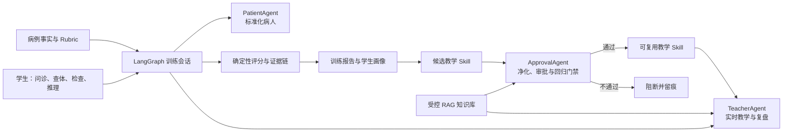

# 临境 OSCE 智能体（TraceOSCE）

> 项目状态（2026-08-06）：竞赛阶段已经结束，仓库进入归档维护。本项目完成了复赛版本，但未获得赛事奖项。以下内容只记录代码中已经实现、可以复现的能力，不把参赛经历当作获奖背书。

TraceOSCE 是一个面向医学教育的诊断学 OSCE 训练系统。它让学生在结构化模拟病例中完成问诊、查体、辅助检查、诊断推理和复盘，并通过标准化病人、教师与审批三个智能体形成“训练—评价—再训练”闭环。

这个项目关注的不是“最后有没有猜中诊断”这一项结果，而是学生如何获取证据、如何组织假设、是否遵守沟通与操作顺序，以及下一轮应在什么时机改进什么动作。

TraceOSCE 不是面向真实患者的医学问答产品，也不提供诊断、治疗、用药或急救建议。

## 项目全貌



系统由三个前后端服务组成：学生端、教师 / 管理端和 FastAPI API。病例事实、Rubric 评分、权限过滤和写入门禁保持确定性；大模型参与自然语言理解、患者表达、教学提示、报告解释和候选 Skill 审批，但不能直接改写标准答案或评分事实。

## 三个智能体

| 智能体 | 已实现职责 | 明确边界 |
| --- | --- | --- |
| PatientAgent | 根据当前病例和可披露范围扮演标准化病人；支持文字 / 语音训练；高级模式可为合理但未配置的查体或检查生成明确标注的 AI 模拟结果 | 不泄露隐藏事实、标准诊断或 Rubric；AI 模拟结果不进入评分 |
| TeacherAgent | 每轮更新训练阶段、证据覆盖、操作顺序、患者状态和跨轮问题；在 `silent`、`observe`、`hint`、`block` 四种策略间决策；提供分层提示和训练后复盘 | 不替学生作答，不修改病例事实或分数；轻度问题先观察，重复或求助时再介入 |
| ApprovalAgent | 审查需要长期保存和复用的候选 Skill；保护病例、阶段、触发条件和来源字段，清理越界内容，重建教学结构并执行回归门禁 | 审批异常时 fail-closed（失败即关闭）；通过只代表满足当前规则和测试，不代表教学内容必然正确 |

即时提示始终由 TeacherAgent 根据当前训练上下文生成。ApprovalAgent 只负责可能进入 Skill 库、影响后续训练的长期教学策略，避免把运行中的每一句提示都变成审批流程。

## 已实现的训练闭环

### 学生端

1. 选择病例和初级 / 中级 / 高级训练难度。
2. 通过自然语言与标准化病人问诊，并在文本与语音模式间切换。
3. 申请查体和辅助检查；界面展示真实的后端处理阶段，而不是只显示一个笼统的等待状态。
4. 记录诊断假设，提交主诊断、鉴别诊断、支持证据和不确定点。
5. 查看本轮得分、能力雷达、素材覆盖、关键决策复盘和下一轮训练处方。
6. 展开评分明细、完整对话、证据链和知识来源，核对报告结论从何而来。
7. 在学习画像中查看跨轮问题、改善状态和已经生效的个人 Skill。

自由文本查体 / 检查只在高级模式开放。病例已经配置的项目返回标准结果；合理但未配置的请求经过脱敏 grounding、模型生成、一致性审核和本地安全门禁后，可返回标注为“AI 模拟”的训练结果。任何环节失败都会阻断，且该结果永不参与 Rubric 评分。

### 教师智能体与训练报告

TeacherAgent 不只在学生点击“请求提示”后工作。问诊、查体、检查、假设更新、诊断提交和边界触发都会产生一条可审计的介入决策；同类提示带有冷却和修复状态，避免把训练变成不断弹答案的导航工具。

训练报告围绕学生下一轮真正能采取的行动组织：

- **本轮结果**：总分、维度得分、能力雷达、诊断与安全 / 沟通结论。
- **证据覆盖**：问诊、查体、辅助检查和推理素材逐项覆盖情况，而不是只给一句笼统结论。
- **关键决策复盘**：最多 3 个有轨迹证据的关键时刻，说明观察到什么、教师如何判断、造成什么影响以及正确下一步。
- **训练处方**：最多 3 个动作，每个动作包含触发条件、具体行为和成功标志。
- **跨轮变化**：区分首次出现、连续出现、改善后再现和本轮暂未再现。
- **详细证据区**：保留评分明细、对话、RAG 引用和审计信息，默认折叠以减少主报告负担。

没有证据缺口的高分学生不会被强行编造弱点，报告会改为强化有效策略和提出跨病例迁移目标。学生与教师页面会优先展示病例名、账号或姓名等可读标签，内部 UUID 只在必要的审计位置保留。

### 教师 / 管理端

除账号级模型配置外，当前管理端已经接入实际 API 和持久化数据，主要包括：

- 总览、训练 Session、报告、事件日志与 Agent 决策轨迹。
- 结构化病例与 Rubric 管理。
- 班级创建、班级成员选择和按班级查看学习分析。
- 全局 / 病例知识库、文档上传、片段审核、来源台账和版本治理。
- 教学洞察、常见漏项和训练重点聚合。
- 候选 Skill 生成、审批 Agent 记录、人工审核、自动应用开关和回归结果。
- 系统评测、RAG 检索评测、失败详情和模型调用日志。
- 服务端分页、搜索、可读名称展示和关键列表 JSON 导出。

生产环境的模型与语音配置仍以服务端环境变量为主；管理员页面不是完整的密钥管理或多租户模型控制台。

## RAG 知识库

当前知识库是项目自行编排的 ChromaDB 检索链，不是 Vertex 托管 RAG：

1. 文档进入系统后被解析、分块并保留来源、病例、训练阶段、可见角色、审核状态和风险标记。
2. 检索前先按病例、阶段、Agent、可见性和人工审核状态过滤候选集。
3. 对学生口语查询做受控扩展，再融合 ChromaDB 向量召回与 BM25 词法召回。
4. 使用 RRF（倒数排名融合）合并结果，并可选调用 `qwen3-rerank` 重排。
5. embedding 不可用时回退到同一安全候选集上的本地词法检索，不绕过权限。

默认本地 embedding 模型为 `BAAI/bge-small-zh-v1.5`，也可选用 Vertex Embedding。知识库支持项目内的 MD、TXT、CSV、HTML、PDF、DOCX、PPTX 和常见图片解析，扫描件和图片文字可通过本地 OCR 提取。内置教学知识覆盖 5 个病例的问诊、查体、检查、提交后复盘和 Skill 审批场景。

RAG 只用于教学提示、复盘、Skill 生成 / 审批和来源追溯，不判断标准诊断，不决定 Rubric 分数，也不能替代病例结构化事实。

## 病例与资料

仓库内置 5 个结构化教学病例：

| 病例 | 模块 | 难度 | 训练主题 |
| --- | --- | --- | --- |
| 右下腹痛教学病例 | 腹痛 | 初级 | 急腹症问诊、查体和阑尾炎证据链 |
| 发热咳嗽伴胸痛教学病例 | 呼吸系统 | 初级 | 感染线索、肺部查体和胸痛鉴别 |
| 心慌、手抖与消瘦教学病例 | 内分泌 | 中级 | 高代谢症状、甲状腺查体和甲功证据 |
| 胸痛伴出汗教学病例 | 心血管 | 中级 | 高危胸痛、心电图和心肌损伤证据 |
| 活动后气短伴夜间憋醒教学病例 | 心血管 | 中级 | 心衰容量负荷、肺部体征和 BNP / 超声证据 |

病例结构参考 Fareez OSCE、MedCaseReasoning、EasyMED 和 SPBench 等公开资料；教学知识参考 AAFP、Merck Manual Professional、NCBI StatPearls、AHA / ACC / HFSA、American Thyroid Association、ATS / IDSA 等公开来源。内容经过改写和结构化加工，但“项目内复核有效”不等同于医学教师审定或临床有效性认证。

详细归因见 [`data/README.md`](data/README.md)、[`docs/数据来源说明.md`](docs/数据来源说明.md) 和 [`data/attribution/source_registry/sources.json`](data/attribution/source_registry/sources.json)。

## 技术实现

| 层 | 技术 |
| --- | --- |
| 学生端 / 管理端 | Next.js、React、TypeScript |
| API | FastAPI、Pydantic、SQLite |
| 训练编排 | LangGraph |
| RAG | ChromaDB、本地 / Vertex Embedding、BM25、RRF、可选 `qwen3-rerank` |
| 模型与语音 | OpenAI-compatible 文本模型、DashScope ASR / TTS |
| 测试 | pytest、Node test、TypeScript typecheck、Next.js build、Playwright 浏览器 E2E |
| 部署 | Docker Compose、GitHub Actions、GHCR 不可变镜像、反向代理 |

目录结构：

```text
apps/web/          学生端
apps/admin/        教师与管理端
services/api/      API、Agent、RAG、评分与持久化
data/              病例、Rubric、知识与来源登记
docs/              设计、实现和验收记录
scripts/           数据、评测与部署脚本
```

## 本地运行

建议使用 Python 3.11+、Node.js 20+、`uv` 和 `pnpm`。

macOS / Linux：

```bash
python3 start-dev.py
```

Windows PowerShell：

```powershell
python '.\start-dev.py'
```

默认入口：

- API：`http://127.0.0.1:8000`
- 学生端：`http://localhost:3000`
- 管理端：`http://127.0.0.1:3100`

`start-dev.py` 使用仅限本机的 `local-dev` 配置并启动两端演示账号。账号、密钥和生产配置不会提交到仓库；具体变量、Cookie Origin、语音、模型和资源限制以 [`.env.example`](.env.example)、[`apps/web/README.md`](apps/web/README.md)、[`apps/admin/README.md`](apps/admin/README.md) 和 [`docker-compose.yml`](docker-compose.yml) 为准。

Docker Compose 会将运行数据保存在 `data/runtime`，病例与 Rubric 使用命名卷。`/health` 只代表进程存活，`/ready` 才代表 API 已满足接流量条件。当前 SQLite revision 与删除墓碑机制覆盖同机多 worker，但不支持把数据库放到 NFS / SMB 后进行多机部署。

## 验证

API：

```bash
cd services/api
uv sync --frozen --extra dev
uv run python3 -m pytest -q tests ../../tests
```

学生端与管理端：

```bash
corepack pnpm --dir apps/web install --frozen-lockfile
corepack pnpm --dir apps/web check
corepack pnpm --dir apps/admin install --frozen-lockfile
corepack pnpm --dir apps/admin check
```

GitHub Actions 使用 Python 3.12、Node.js 24 和 pnpm 10.5.1 执行 API、两端前端检查与隔离 Docker 浏览器 E2E。真实场景回归覆盖证据链不足、合理但错误的鉴别诊断、未取得同意的操作顺序、忽视患者焦虑、高分学生保护、跨轮问题复现，以及完整的登录—训练—报告—管理端查看链路。

比赛分支通过全部检查后，会按 Git SHA 向 GHCR 发布 API、学生端和管理端三个不可变镜像。生产部署脚本会先检查旧服务健康、备份 SQLite、拉取指定 SHA、等待新服务就绪；失败时自动切回旧镜像。只修改 README 等非服务文件时会复用上一版镜像，不重新构建三个应用。

关键实现与验收记录：

- [`docs/2026-08-03-功能对齐真实场景验收记录.md`](docs/2026-08-03-功能对齐真实场景验收记录.md)
- [`docs/2026-08-04-教师智能体实时介入决策说明.md`](docs/2026-08-04-教师智能体实时介入决策说明.md)
- [`docs/2026-08-05-学生训练报告V2实现说明.md`](docs/2026-08-05-学生训练报告V2实现说明.md)
- [`docs/安全边界说明.md`](docs/安全边界说明.md)

## 当前边界

- 只有 5 个内置病例，无法代表完整医学课程体系。
- 当前验收主要是受控模拟学生、自动化测试和真实浏览器流程，不是随机对照研究，也不能证明真实医学生的长期学习效果。
- ApprovalAgent 是 fail-closed 守门器，不是医学内容“必然正确”的保证；长期启用的 Skill 仍应由教师抽查。
- 知识来源登记、版本和审核状态提供可追溯性，不等同于正式教材认证或临床指南审核。
- SQLite 和当前认证方案适合单机受控部署；正式多机、多机构使用应迁移 PostgreSQL 并补充更完整的身份、权限、密钥托管、备份和监控体系。
- 管理端没有实现完整的账号级模型密钥管理控制台，生产模型配置仍由服务器环境控制。
- 语音、外部模型、OCR 和 reranker 依赖第三方服务或本地模型资源，其可用性和成本需要部署方自行评估。

## License

当前仓库未单独声明代码许可证。病例参考、数据来源和外部材料归因请以 [`data/attribution/source_registry/sources.json`](data/attribution/source_registry/sources.json) 与 [`docs/数据来源说明.md`](docs/数据来源说明.md) 为准。
